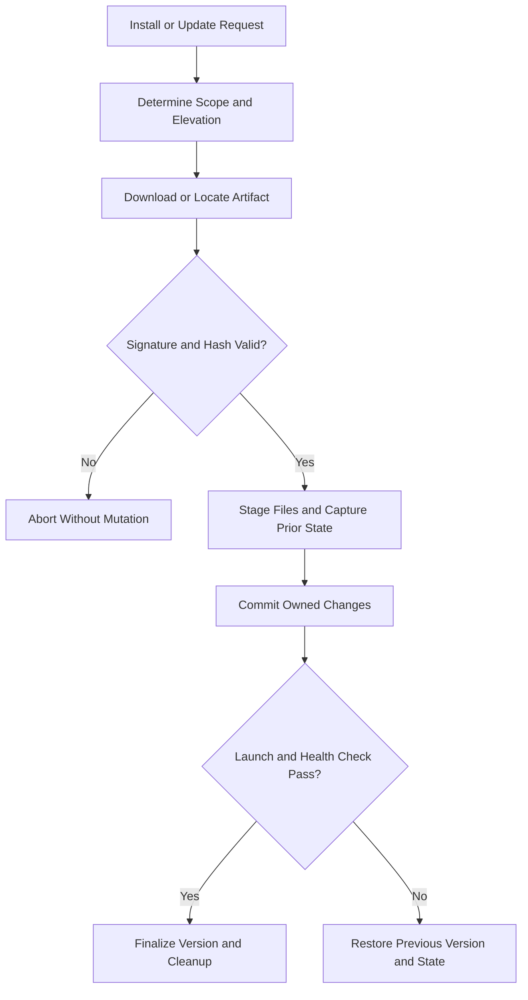
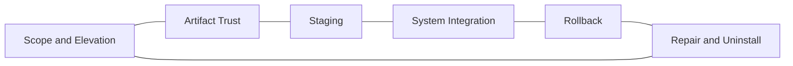

# Windows Installer and Updater Reference

## Overview

This reference governs Windows setup, elevation, repair, update, rollback, uninstall, artifact verification, process replacement, and ownership of machine changes. Installers must be transactional enough to recover from interruption and explicit about retained system integrations.

---

## How AI Agents Should Use This Skill

Load this reference before changing installation scripts, self-update logic, registry integration, shortcuts, services, PATH entries, scheduled tasks, or uninstall behavior. Inventory every owned resource and preserve user-required installer features unless explicitly removed.

### Activation Triggers

- Setup, install, update, repair, migrate, rollback, or uninstall.
- Elevation, UAC, registry writes, PATH, shortcuts, or file associations.
- Downloaded artifacts, checksums, signatures, versions, or release channels.
- Replacing running executables or recovering interrupted updates.

### Step-by-Step Agent Workflow

1. Inventory product-owned files and system resources.
2. Define install scope, elevation, version transition, and compatibility.
3. Stage and authenticate artifacts before mutation.
4. Capture rollback state and stop affected processes safely.
5. Commit changes atomically where possible.
6. Verify launch, repair, repeat-run, rollback, and uninstall paths.

---

## Mermaid Installer Transaction Flow

## Mermaid Installer Domain Map

---

## Global Guards

### Forbidden Behaviors

- Updating from an unauthenticated or mutable artifact reference.
- Modifying system state before verification and rollback capture.
- Removing resources not demonstrably owned by the product.
- Treating a partially copied update as installed.
- Silently dropping an explicitly retained integration such as IFEO redirection.

### Required Behaviors

- Verify version, hash, signature, and expected publisher when available.
- Stage before commit and preserve the last known working version.
- Make repair and repeated installation safe.
- Keep elevated work minimal and visible.
- Log each owned mutation and its rollback result.

## Domain Rules

### Installation Ownership

- Maintain an inventory of files, keys, tasks, shortcuts, and services.
- Store enough prior state to restore values that predated installation.

### Updating

- Separate download, verification, staging, commit, and cleanup.
- Never execute a newly downloaded artifact before authentication.

### Rollback and Repair

- Roll back from staged backups, not from a fresh network fetch.
- Repair must recreate missing owned state without duplicating it.

### Uninstall

- Preserve user data unless removal is explicit.
- Restore replaced system values only when ownership and prior state are known.

## Verification Checklist

- Clean install and repeated install pass.
- Upgrade and downgrade policy is enforced.
- Interrupted update recovers.
- Repair restores owned resources.
- Uninstall removes only owned resources.
- Required HKLM IFEO behavior remains verifiably present when configured.

## Integration Map

- Use `windows_systems.md` for registry, process, and privilege mechanics.
- Use `security_engineering.md` for artifact and update trust.
- Use `package_release.md` for release provenance.
- Use `observability_debugging.md` for installer logs and failure evidence.

## Completion Contract

Installer work is complete only when clean install, update, interruption recovery, repair, and uninstall have verified ownership-aware outcomes.
