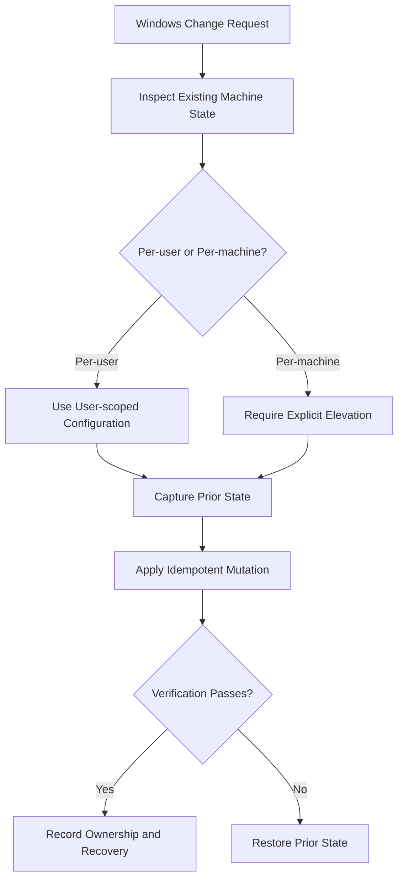
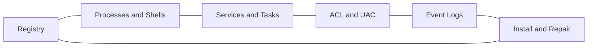

# Windows Systems Reference

## Overview

This reference governs Windows-specific engineering involving the registry, services, scheduled tasks, process launch, PowerShell, access control lists, UAC, event logs, installers, and operating-system integration. Windows changes must be reversible, architecture-aware, explicit about elevation, and verified against the actual machine state.

---

## How AI Agents Should Use This Skill

Load this reference before editing Windows setup scripts, registry keys, service definitions, scheduled tasks, shell integrations, file associations, environment variables, or system-wide configuration. Read the current implementation and query existing state before proposing mutations. Preserve user-required system integrations, including intentionally retained IFEO behavior, unless the user explicitly requests removal.

### Activation Triggers

- Registry, HKCU, HKLM, IFEO, PATH, App Paths, or file associations.
- PowerShell, batch files, Windows Terminal, elevation, or UAC.
- Windows services, scheduled tasks, named pipes, or event logs.
- MSI, MSIX, winget, Chocolatey, Scoop, uninstall, or repair behavior.
- ACLs, integrity levels, process architecture, or WOW64 redirection.

### Step-by-Step Agent Workflow

1. Inspect the scripts, manifests, registry paths, and current architecture.
2. Classify scope as per-user, per-machine, elevated, service, or installer-owned.
3. Capture the prior state required for rollback.
4. Apply the smallest idempotent change with explicit error handling.
5. Verify both success state and uninstall or rollback behavior.
6. Report elevation requirements, affected paths, and recovery commands.

---

## Mermaid Windows Change Flow

## Mermaid Windows Domain Map

---

## Global Guards

### Forbidden Behaviors

- Deleting unknown registry keys or values without capturing prior state.
- Hiding elevation prompts or claiming administrator access is unnecessary.
- Writing machine-wide configuration when a user-scoped option satisfies the requirement.
- Assuming PowerShell edition, processor architecture, or filesystem location.
- Disabling security controls to make installation easier.

### Required Behaviors

- Use literal paths and structured registry APIs.
- Distinguish Windows PowerShell from PowerShell 7.
- Treat HKLM, services, drivers, and system task changes as privileged operations.
- Make setup, repair, and uninstall idempotent.
- Preserve logs and keep failures visible.

## Domain Rules

### Registry

- Verify key existence, value type, and registry view before mutation.
- Record owner component and uninstall behavior.
- For IFEO, validate the exact executable target and debugger command.

### Processes and PowerShell

- Pass arguments as arrays where APIs permit.
- Avoid command-string interpolation of untrusted values.
- Propagate exit codes and distinguish launch failure from child-process failure.

### Services and Tasks

- Use least-privilege identities.
- Define recovery, timeout, startup, and shutdown behavior.
- Remove only resources owned by the product.

### Diagnostics

- Prefer event logs and structured local logs over silent catches.
- Include operation, target, result code, and recovery context.

## Verification Checklist

- Scope and elevation are explicit.
- Existing state was inspected and rollback data exists.
- Re-running the operation is safe.
- Uninstall does not remove unrelated state.
- x64, x86, and path redirection assumptions are checked.
- Required Windows behavior remains present after unrelated changes.

## Integration Map

- Use `windows_installer_updater.md` for setup, repair, update, and uninstall lifecycles.
- Use `security_engineering.md` for privileged boundaries and abuse analysis.
- Use `observability_debugging.md` for logs, dumps, and event correlation.
- Use `cli_tui_engineering.md` for PowerShell and command-line UX.

## Completion Contract

A Windows systems change is complete only when the intended state, privilege boundary, repeat-run behavior, and rollback path have all been verified.
